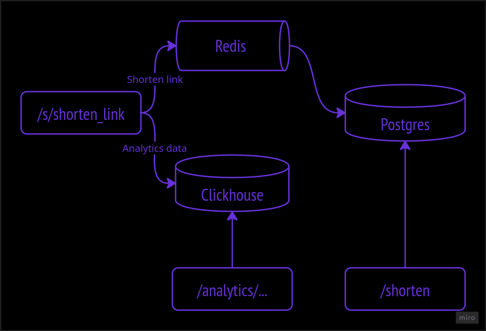

# Shortener — сервис сокращения URL с аналитикой

> - Позволяет сокращать ссылки, генерируя случайные сокращенные
> - Поддерживает кастомные сокращенные ссылки
> - Собирает анатилику в Clickhouse
> - Кеширует популярные ссылки в Redis
---

## Быстрый старт 

```
git clone https://github.com/child6yo/wbtech-l3-shortener

docker compose up 
```

- практически вся система конфигурируема через .env

## API

### POST /shorten — создание новой сокращённой ссылки;

#### Request
```
curl -X POST 'localhost:8080/shorten' \
--data '{
    "full": "link",
    "custom": "custom short link"
}'
```

- поле custom - опционально

#### Response 
*200 OK*
{
    "shorten_link": "shorten link"
}

*400 Bad Request/500 Internal Server Error*
```
    "error": "some error"
```

### GET /s/{short_url} — переход по короткой ссылке;

#### Request

```
curl -X GET 'localhost:8080/s/{short_url}'
```

#### Response

*301 Moved Permanently*

*500 Internal Server Error*
```
    "error": "some error"
```

### GET /analytics/{short_url} — получение аналитики (число переходов, User-Agent, время переходов).

#### Request
```
curl -X GET 'localhost:8080/analytics/{short_url}?group_by_day&group_by_user_agent'
```

*Доступные query параметры:*
- *group_by_day* - агрегация по дню
- *group_by_month* - агрегация по месяцу
- *group_by_user_agent* - агрегация по user agent

* агрегации по датам не совместимы между собой, но совместимы с агрегацией по user agent
* если не передать ни одного параметра - вернется агрегация по user agent.

#### Response
*200 OK*
```
[
    {
        "date": "2025-10-23T00:00:00Z",
        "user_agent": "Mozilla/5.0 (X11; Linux x86_64; rv:144.0) Gecko/20100101 Firefox/144.0",
        "count": 1
    },
    ...
    {
        ...
    }
]
```

*500 Internal Server Error*
```
    "error": "failed to get aggregated transits"
```

## Архитектура



